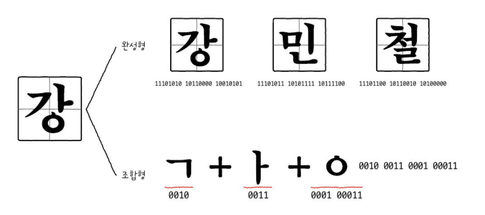
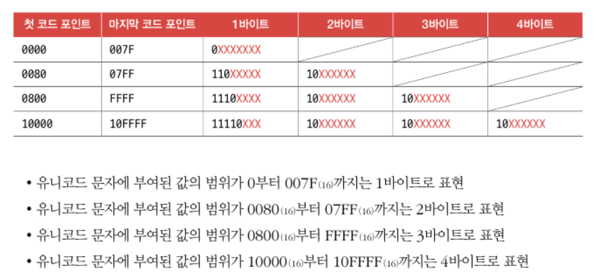

2장 정리

1. 아스키 코드 (American Standard Code for Information Interchange)

7비트로 표현하는 문자체계

2. EUC-KR
한글 인코딩에는 두 가지 방식, 완성형(한글 완성형 인코딩)과 조합형(한글 조합형 인코등)이 존재한다.
완성형 인코딩 방식은 초성, 중성, 종성의 조합으로 이루어진 완성된 하나의 글자에 고유한 코드를 부여하는 인코딩 방식

조합형 인코딩 방식은 초성을 위한 비트열, 중성을 위한 비트열, 종성을 위한 비트열을 할당하여 그것들의 조합으로 하나의 글자코드를 완성하는 인코딩 방식

EUC-KR은 KS X 1001, KS X 1003이라는 문자집합을 기반으로 하는 대표적인 완성형 인코딩 방식이다. EUC-KR은 한글단어에 2바이트 크기를 부여한다.(16비트)

EUC-KR이 표현할 수 없는 문자들은 글자가 깨지는 상황이 나오는데 이를 보완하기위해 나온 것이 CP949이다.

3.UTF-8
Unicode Tranformation Format의 약자이다.
글자에 부여된 값을 다양한 방법으로 인코딩을 하는 방식이다. UTF-8, UTF-16, UTF-32 등이 있다.
가장 대중적인 UTF-8은 1바이트 부터 4바이트까지 문자가 가진 값의 범위 따라 인코딩 결과가 달라진다.

